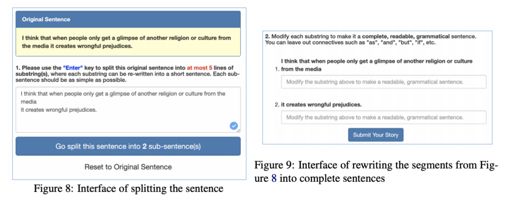

# DeSSE: Decomposing Sentences in Students Essays 

DeSSE is a corpus collected from students opinions essays in a social science class. Students watched videos and wrote essays in a blog-like envinronment. DeSSE is introduced under two settings: 1) Connective Prediction, from a paper appeared in TextGraph 2021; 2) Complex Sentence Decomposition, from a paper appeared in ACL 2021.  

DeSSE is annotated through Amazon Mechanical Turk, with an unique interface that allows annotators to split, rewrite the sentences, and drop some words to keep the output grammatical correct. Every sentence could be rewritten into one or multiple simple sentences, with the meanings preserved. The interface is designed by Ting-hao Huang (Kenneth).  

Students are free to express their opinions in their writings, and we do not hold the responsibility for their opinion and speech. 



This repository also has MinWiki corpus, a modified subset from WikiSplit for complex sentence decompositions. See more details below. 

## Repository Settings
We release two settings, corresponding to two folders under this repository. The TextGraphs2021 folder has four CSV file, where each of them contains a list of pairs of simple sentences with a connective that could join them back to a complex sentence. The ACL2021 folder has 6 text files, which are for complex sentence decomposition task. 

## Connective Prediction 
We direct you to TextGraphs 2021 "Learning Clause Representation from Dependency-Anchor Graph for Connective Prediction" paper for more details. The data could be found under TextGraphs2021. If you use our data for this setting, please cite our TextGraph paper: 
```
@inproceedings{gao-etal-2021-learning,
    title = "Learning Clause Representation from Dependency-Anchor Graph for Connective Prediction",
    author = "Gao, Yanjun  and
      Huang, Ting-Hao  and
      Passonneau, Rebecca J.",
    booktitle = "Proceedings of the Fifteenth Workshop on Graph-Based Methods for Natural Language Processing (TextGraphs-15)",
    month = jun,
    year = "2021",
    address = "Mexico City, Mexico",
    publisher = "Association for Computational Linguistics",
    url = "https://aclanthology.org/2021.textgraphs-1.6",
    pages = "54--66",
}
```

## Complex Sentence Decomposition 
Under this setting, we use DeSSE to train a sentence rewritter that will rewrite a complex sentnece into multiple simple sentences. Under the folder of ACL2021, you will see .complex and .simple file, where each line in .complex is decomposed by the annotators into the same line in .simple. The data is split into Train/Valid/Test. We direct you to the ACL 2O21 paper: "ABCD: A Graph Framework to Convert Complex Sentences to a Covering Set of Simple Sentences". If you use our data for this setting, please cite our ACL paper:
```
@inproceedings{gao-etal-2021-abcd,
    title = "{ABCD}: A Graph Framework to Convert Complex Sentences to a Covering Set of Simple Sentences",
    author = "Gao, Yanjun  and
      Huang, Ting-Hao  and
      Passonneau, Rebecca J.",
    booktitle = "Proceedings of the 59th Annual Meeting of the Association for Computational Linguistics and the 11th International Joint Conference on Natural Language Processing (Volume 1: Long Papers)",
    month = aug,
    year = "2021",
    address = "Online",
    publisher = "Association for Computational Linguistics",
    url = "https://aclanthology.org/2021.acl-long.303",
    doi = "10.18653/v1/2021.acl-long.303",
    pages = "3919--3931",
}
``` 

## Complex Sentence Decomposition -- MinWiki Corpus 

Our ABCD paper also introduces a modified corpus of WikiSplit, one of the largest sentence simplification corpus. To make it a corpus for complex sentence decomposition, we filtered out the sentences where the number of predicates (numbers of tensed Verb Phrases) in the original sentences did not match with number of simple sentences. If you are using MinWiki, cite our ACL paper: 

```
@inproceedings{gao-etal-2021-abcd,
    title = "{ABCD}: A Graph Framework to Convert Complex Sentences to a Covering Set of Simple Sentences",
    author = "Gao, Yanjun  and
      Huang, Ting-Hao  and
      Passonneau, Rebecca J.",
    booktitle = "Proceedings of the 59th Annual Meeting of the Association for Computational Linguistics and the 11th International Joint Conference on Natural Language Processing (Volume 1: Long Papers)",
    month = aug,
    year = "2021",
    address = "Online",
    publisher = "Association for Computational Linguistics",
    url = "https://aclanthology.org/2021.acl-long.303",
    doi = "10.18653/v1/2021.acl-long.303",
    pages = "3919--3931",
}
``` 


